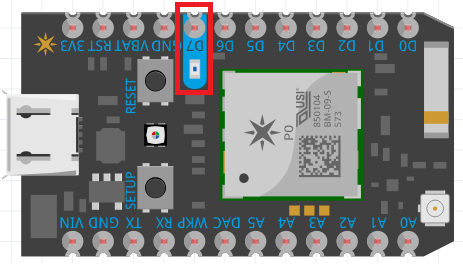
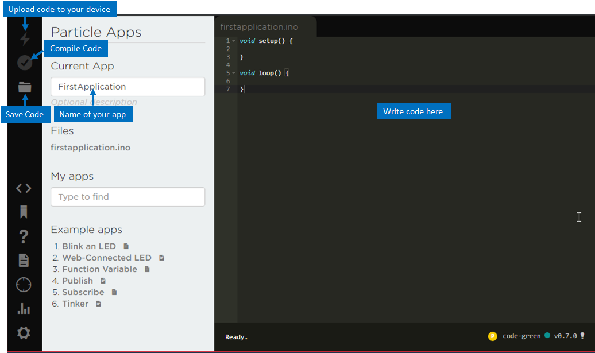

# Lesson 1 - Introduction
* What we’ll be doing in the class through the whole semester
* Show the end product	
  * App with working sensors.
* Show the Photon device plugged in (it will be set up already i.e., connected to the internet and the account setup), talk about what purpose the Photon serves.
* Download the Particle app, and have students turn the internal LED ON
  * Open the Particle app
  * Log in with the credentials provided
  * Select your device
  * Select D7 (when it says HIGH next to it, the LED should be turned ON).

  


# Your First Program
Login to Photon IDE and use code to turn on the internal LED.
* Navigate to https://build.particle.io/build and log in with the credentials you used for the app
* Skip two-factor authentication by clicking on skip for now
  
  


You are now in the Photon IDE (Integrated Development Environment). This is where you’ll write code, save it, compile it, and upload it to the Photon device. 

```
<explain what compile and upload means>
```



```
<Explain how ino code works> i.e., setup runs once and then loop runs over and over.
```

Write your first program to turn on the internal LED. Under void setup(), write:

```arduino
pinMode(D7, OUTPUT);
digitalWrite(D7, HIGH);
```

Your final program should look like this:
```arduino
void setup() {
  pinMode(D7, OUTPUT);
  digitalWrite(D7, HIGH);
}

void loop() {  
}
```

Verify and Upload the code. The light on the Photon should light up!

```
<Explain how this works>
```

Edit this program to blink the LED:
Remove digitalWrite(D7, HIGH); from under void setup()
Add under void loop(), the following lines:

```arduino
digitalWrite(D7, HIGH);
delay(1000);
digitalWrite(D7, LOW);
delay(1000);
```

Your program should like this now:
```arduino
void setup() {
  pinMode(D7, OUTPUT);
}

void loop() {
  digitalWrite(D7, HIGH);
  delay(1000);
  digitalWrite(D7, LOW);
  delay(1000);
}
```

Verify and Upload the code. The light on the Photon should now be blinking!

```
<Explain how this works>
```

Play around with the 1000 value and see how it changes the blinking pattern.
